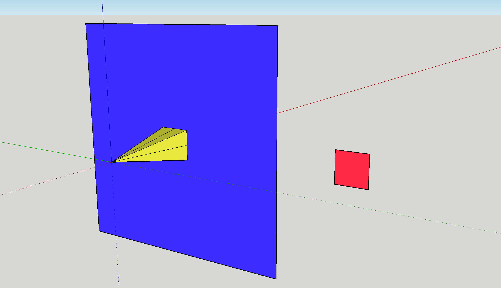
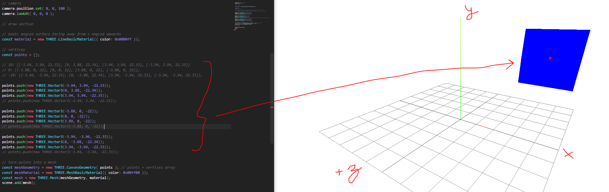

### Pan/tilt sampling

I've been stuck on this for a while just because it doesn't look right on ThreeJS.
Maybe I'm getting the right values but I'm not plotting them in the right order.
I should be seeing a plane which I have plotted before with test coordinates.

I'm cheating with 3D modeling vs. raw math to visually view stuff/get coordinates.

This is a visual example of a 10 deg sample at [10, 0, -10] tilt samples with [10, 0, -10] deg pan samples per tilt angle.



The red is the plane that should get plotted in ThreeJS.

Each vertice of the polygon is an ultrasonic/lidar sample distance. The vertice length for each side of the "pyramid" is 22.67" which the center one is 22"

I have written math for this already/prototyped it in JS fiddle. It's a mix of sine/cosine.

This is the set of coordinates grabbed from sketchup that my function should generate.

Coordinate system is [x, y, z] z being red axis in image

Units in inches(sorry metric people)

```
[-3.88, 3.88, 0], [0, 3.88, 0], [3.88, 3.88, 0]
[-3.88, 0, 0], [0, 0, 0], [3.88, 0, 0]
[-3.88, -3.88, 0], [0, -3.88, 0], [3.88, -3.88, 0]
```

plotted from point of measurement (switch 0 with 22)

```
[-3.88, 3.88, 22], [0, 3.88, 22], [3.88, 3.88, 22]
[-3.88, 0, 22], [0, 0, 22], [3.88, 0, 22]
[-3.88, -3.88, 22], [0, -3.88, 22], [3.88, -3.88, 22]
```

function is of the form `function getCoordinates(distance, sweep, tilt)`

I've got a song on loop blasting down my ears and heavy caffeine, like forced programming at Guantanamo or something.
Arguably less productive than silence when not performing rote coding.
When I need to focus I'll usually loop some song over and over like an insane person

Alright I'll concede need silence for this... figuring out this coordinate calculator thing
I had an epiphany while getting some water... the full sweep is mirrored so x * y = whatever number squared eg. 3 = 9 points
... I don't have to figure out the sweep angles based on number of measurements, I'll just use the tilt angles that are being used as the measurement keys
Referring to the current JSFiddle version [here](https://jsfiddle.net/ys6hzbk4/21/)

I like to prototype snippets of code in a sandbox like this
Awe how cute, he's struggling with basic trig... WolframAlpha is great, had to convert from degrees to radians for `Math.sin` to work right

Having problems again with full sweep ignoring delays

Ughh... I did this wrong. I'm just connecting rows of dots not the four corners of a square, I'm missing some steps

Groupoo

I'm not great at math so this is a struggle... how do you slice a matrix into quadrants by nearby four points?

What happens if I just plot all these points as is?

Oh man... I'm lucky joins the planes for you... need an irregular shape sample though to confirm



I just realized I may be underpowering the Arduino since the power is setup as a Y-feed from the step up converter. I measured the Vin rails of the Arduino and it's only 4.9V from the 5V source shared by the Pi... docs say it's supposed to be 7-12V hmm... wondering if that's related to the ureliable timer.

I may have to rework this. Something ugly like step up to 7V, parallel feed to Arduino Vin and linear regulator down to 5V to Pi... ehh that sucks.