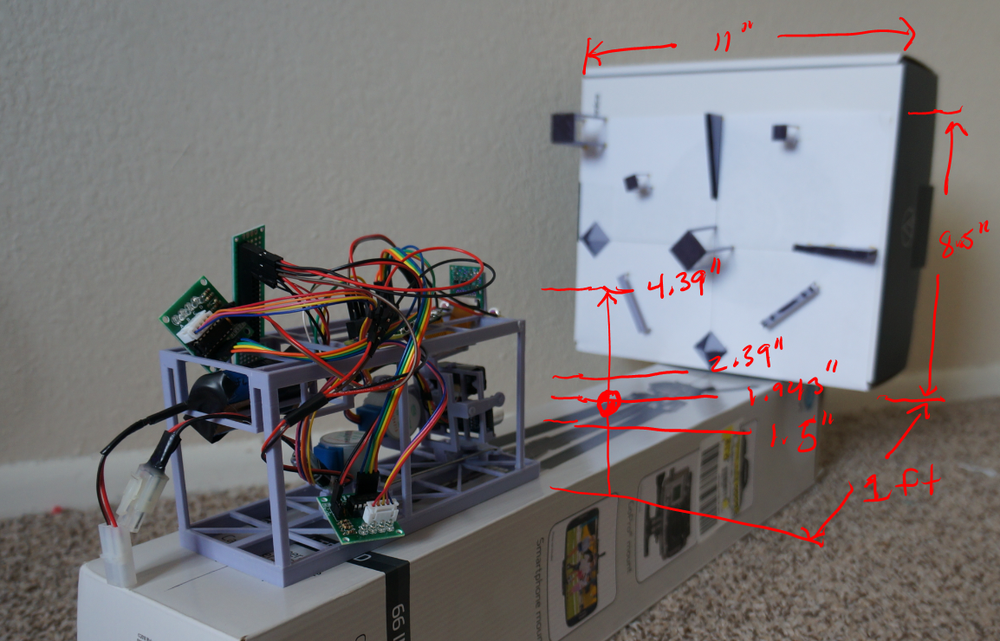

# A hybrid sensor for depth sensing navigation
(haha sounds fancy)

## What is it
This is a "tech demonstrator" if you will for me. The intent is to create a depth map from a combination of OpenCV and hard physical measurements. It has a lot of flaws but it has all the minimum parts for the end goal. It's also arguable you don't really need this but to me it's nice having a physical measurement source(single-point lidar/ultrasonic sensor).

## Sensors
* single camera
* single-point "lidar" (> 1 Ft)
* ultrasonic sensor (< 1 Ft)

## How does it work
Initially I tried to have everything run on a Pi Zero W and also use steppers... but those were both bad ideas regarding positioning/boot problems. So now I have the Pi talking to an Arduino Nano.

The interface(web or possibly C++ desktop app) connects to a web server/socket that the Pi hosts. The Pi then calls a python script by Node, the python script gets cli params passed in for which servo to move and to what degree position(0-180). Then the Pi sends that to the Arduino by I2C.

The interface allows manual control but the intent is for OpenCV to take an image, run some computations(eg. edge, contour, centroid, etc...) and determine points of interest to measure. The result estimated angle based on size/pixel offset from center/focal length, etc... will determine where to point the sensors and get a measurement. Generally can also just do sweeping/panning and gather data that way as well.

In the end this would work "autonomously" but the manual interface is for calibration/testing. Also with the Arduino attached I can connect this to a robot/moving vehicle... in this case it will just be a basic 2-wheeled-cr-servo-tail-dragging robot that [I made in the past](https://github.com/jdc-cunningham/noob-robotics/tree/master/taildragger-ultrasound-mapping#other-materials).

This would ideally spit out an annotated image with depth measurements for me to confirm the right things are getting looked at. This calibration stand should be "easy" regarding black/white cont rast. Concern is size/angle of components regarding if beam will return.

I admit the OpenCV part is hard... I mean I tried it weeks/month(s) ago and it was disappointing the edge detection as most pictures are not clean/have obvious gradients/stuff to measure. Also the other thing is it's SO SLOW... as in 30x slower than a full-sized pi. It must be those cores... anyway it's probable I will process the images by an API so this thing is even more unnecessarily complicated.

## Code flow
Web interface is "optional" for calibration/manual command. Ideally it would just work, the OpenCV part would drive it all along with spatial math/physical measurements/and movement.

The Pi hosts a webserver and socket(don't really need both). The commands from the web interface eg. manual arrow clicks for moving the sensor head pan/tilt is captured by the pi websocket(node) and talks to the Arduino by I2C sending a comand like `t178` which means tilt servo to 178 deg. This command is passed from the node socket to pi by doing an os system call, running the python script `move-servo.py` with the `t` and `178` as CLI params.

## Status

### 11-12-2020
I have written a basic pan/tilt measurement sampling workflow which is then plotted in 3D using ThreeJS. The implementation is basic right now as I have to finish figuring out the math aspect/rendering it correctly.

### 10-28-2020
At this time this project is far from complete. This is also not really meant to be reproduced, it has a lot of flaws.

It's funny like how much of a piece of crap it looks like and how much work it takes too... printing the top part for example took 7 hrs...