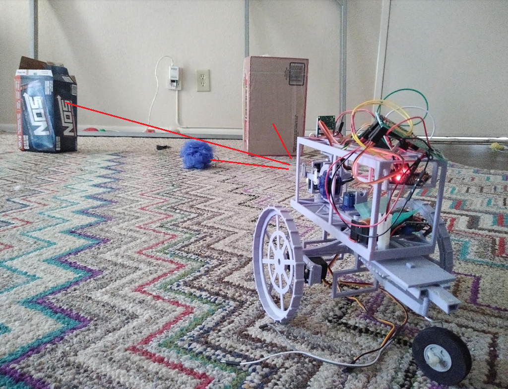
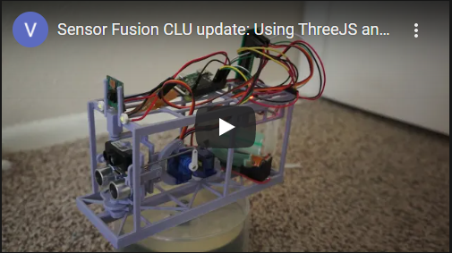

## Update

The second/current version of this approach is [here](https://github.com/jdc-cunningham/pi-zero-2-robot-navigation-head) "Chisel Bot"

## About
This is a piece of crap SLAM from scratch attempt with a Raspberry Pi, camera, ultrasonic/"lidar" sensor on a pan/tilt bed and a 9-axis IMU. Please note I am coming from web-application development so I'm not a SLAM expert or anything, this is just some hobby/fun project for me, don't reference it for anything that matters.

## Completion
- [ ] vision system
  - [x] basics of masking, determining color and light ranges by histograms, determining bounding boxes of largest contour areas
  - [ ] make an algorithm for sampling based on available data ranges and best way to find all objects in an image due to various colors/shapes
  - [ ] get the center of the largest boxes
  - [ ] figure out how to gauge where the object is and then point the sensors at it to get a depth measurement
    - this can be based on camera physical properties but also just sampling with lidar/ultrasonic sensors
- [ ] interface with IMU
  - [ ] connect and get values
  - [ ] estimate position based on rest/accel/velocity
  - [ ] use this to translate points to keep track of where things are
- [ ] add drive servos to body/use external battery separately to drive wheels
- [ ] complete the system where it can be turned on, starts navigating on its own and outputs telemetry to web interface

### Example application

I am aware that there are methods out there like "visual inertial semantic representation" which are insane! I've seen drone applications with a single camera and it's frame-by-frame attaching dots to things and keeping track of them. No distance measuring like I am. And they pair that with the IMU data to generate depth that's my understanding anyway.

The shot above "why not use an ultrasonic sensor" well they suck on their own. If you're just dealing with perfect walls/no angles then yeah they work great. I'm also aware my approach is probably dumb but this whole project is a learning mechanism for me.

Initially I thought the sensors were way more accurate than they actually are. At the moment I believe the "lidar" at best is for measurements above 2 feet and the ultrasonic sensor is the opposite.

This build is bad in many ways primarily due to the mechanical design/materials and lack of feedback from the pan/tilt sensor bed.

## The stack
- web
  - ReactJS, websocket, ThreeJS
- robot
  - Raspberry Pi
    - NodeJS for server/websocket
    - Python for i2c to Arduino, 3D point cloud/collision
    - OpenCV for visual aspect mainly finding objects, bounding, getting centroid for distance measurement
  - Arduino
    - moves servos for pan tilt by i2c commands
    - moves two 360 deg rotation servos for movement

While I do have a web interface for a visual aspect and manual controls, this robot is intended to operate on its own. The 3D point cloud environment is maintained in memory against the IMU measurements, that's the plan anyway.

### The web interface

Primarily as mentioned this interface just gives you direct control. Ideally/in the end the ThreeJS part will be almost real time showing the robot's position and the moving environment around it based on what was tracked before. It will all be super dumbed down eg. "everything is a box". One thing I have to figure out as well is mapping the horizon/ground plane.

### The vision aspect

This is probably the hardest thing about this project for me followed by the IMU aspect as I have not interfaced with an IMU yet.

The current process is:
* get image
* apply 1D and 2D histograms to get light profile and HS values from image
* use those values for the HSV masks
* find contours by largest area
* get centeroid position of boxes
* determine angles to point sensor bed to get distance
  * maybe involves an initial panning sample with lidar due to angle/fov issue of seen object
* pass these values to the "world coordinate engine" ooh buzzwords

### The maths/IMU
* points are determined for 3D plotting
  * go into ThreeJS for visual
  * go into Python/ram
* IMU values are at center of world, its motions translate the tracked points to simulate reality where objects are/were
* using this and 3D collision detection(box overlap) can tell if you're going to run into something or not
* the known freespace in front determines how far the robot can go before doing something/doing more measurements

### The "main loop"
This is the logic of the robot/why it does what it does. Which is pretty much to keep moving forward if possible. Ultimately the goal of it is to try and map the room. I know I know... just buy a spinning lidar. But That's not the point again not dealing with perfect walls. Also eventually I will take what I've learned here and move onto more powerful boards eg. a Beaglebone or STM32.

### Fantasy/future
* recognition of previously seen objects
  * this one is kind of hard since the objects are all blocks but you could try and average boxes/points and roughly realize these "constellations" haha bs, are some area you've been at before.
* ML for finding the boxes
  * I don't know how feasible, excuse for me to finally try and learn ML for real. I'd have to take so many sample images and annotate them. I had a thought where if the robot fails/runs into something, the last image it has/predictions I could correct(tech parrot).

## Progress

####  11-12-2020
I have written a basic pan/tilt measurement sampling workflow which is then plotted in 3D using ThreeJS. The implementation is basic right now as I have to finish figuring out the math aspect/rendering it correctly.

#### 10-28-2020
At this time this project is far from complete. This is also not really meant to be reproduced, it has a lot of flaws.

It's funny like how much of a piece of crap it looks like and how much work it takes too... printing the top part for example took 7 hrs...
