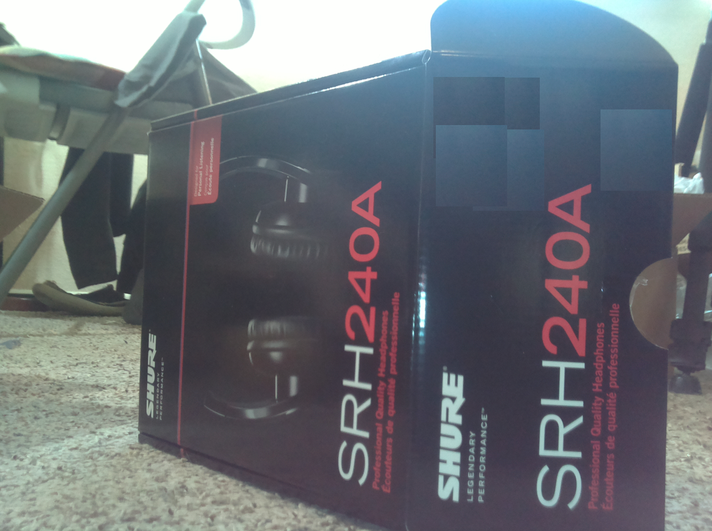
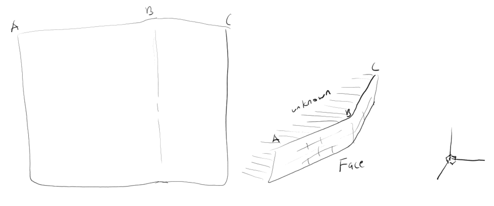

### Here is an example scanning workflow

#### Sweep only, no OpenCV
#### Example scene
This is a dark box with two angles, very simple shape.

This box is a foot away, I don't know the angles. It does not have to be exact down to half an angle or something, point is to at least be able to see this thing with two faces that vary in angle.

I did notice when taking a photo, the box looked closer.

The intent is to be able to generate faces like this(for visual and for collision math)

#### Actual code workflow
##### Web interface
- match sweep time
  - simple test, run a sweep command slow speed, manually run sensor measurements
    can use ultrasonic sensor high sweep speed sampling for nearby profiling
  - so... that's kind of disappointing, the "lidar" seems to work best if it's around or at least 2ft away
  - the ultrasonic sensor on the other hand seems pretty accurate... so maybe I can do "long range" scanning with the "lidar" and do some close profile sampling with the ultrasonic sensor, trying 1.5" as the range
  - for the "lidar" there is a 2-3cm accuracy people pointed out... so I positioned it 18" or 1.5ft away in cm that should be 45.72 but I get 51 which is just under 20"
  - ultrasonic sensor on the other hand is bang on at 18.27 in
##### Pi
##### Arduinorepo-images/intent.PNG