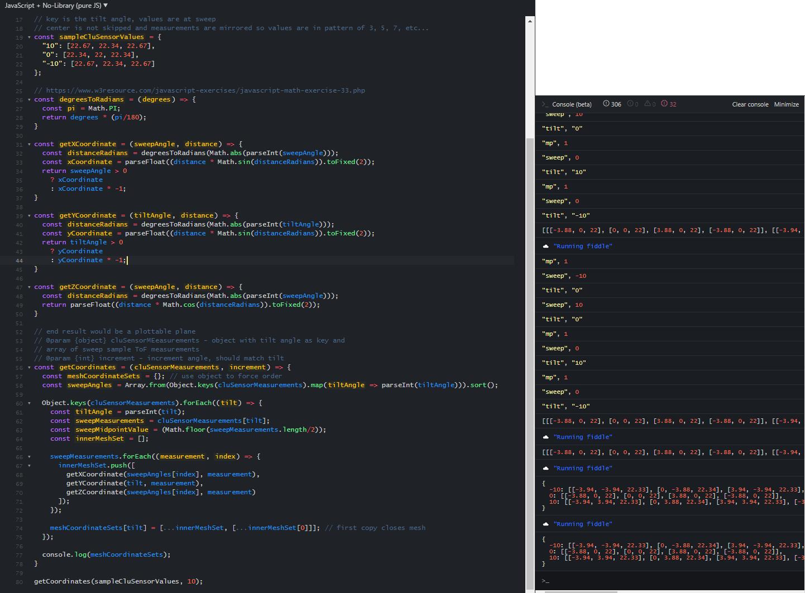

- ### updates
  - [ ] dpad
    - [ ] add bars/slider
    - [ ] add quick center
    - [x] add setup of major/minor ticks eg. increment by 1 vs. 5
      - only one input but variable
  - [ ] move servo code
    - [ ] add callback when seharvo is done moving, or add matching delay before buttons enabled/able to move again
      - callback from Arduino i2c probably better in case comm delay

- ### reminders
  - socket service user specified is pi to have access to smbus2

- ### "Geometric error"
This is due to the sensors rotating about an offset shared central axis particularly for pitch
Pan has its own problems(since the sensor emit/return are not on the same point/axis)

### Next
- [ ] add background task to Arduino code to unblock itself
- [ ] add reset btn on ui/feed to Arduino
  - happens when some process in Arduino doesn't finish and global variable "something in process"
    left to true
- [x] fix issue with rerender on input after threejs has rendered once
- [x] fix math and update plotting for threejs/add toggles
- [ ] add led lidar
  - test it
  - add as secondary check to confirm measurements
    usensor bad on corners facing away from sensor
- [ ] add method to plot robot as rectangular box in center of ThreeJS plot

### 12/10/2020
Putting a little bit of time in. My brain is not phenomenal I still feel ike a monkey when I can't immediately get some spatial thing. Anyway I took this picture as a reference, shows what the camera can see full resolution. Man idk why this camera sucks but it also wasn't expensive. It's good enough for blob detection.

Also interesting how much of "below the horizon" it sees at the height relative to the floor as a reference

Still don't know yet how to point the sensors at something in picture.
Ugh... my brain sucks. Going to cheat with Sketchup/Cad

For example at 3" the bottom sensor(ultrasonic) has to angle itself 4.5 degrees up to point at the center of the camera frame.

I think aside from general "inference"? Interpretation... idk... I could at the very least do a center sensor sample to get an immediate depth... may suck if something is in front of the object but you could assuming having easy contours use that object as an estimation for everything else based on its bounding box contour size...

There's a relationship though, at least it's a simple right-angle triangle. Half of 36" away it's 9 deg angle up.
The Lidar is a little different, 3.1 deg for 36" and 6.2deg for 18"

Image AR is 1.33 (4/3) or 0.75 (3/4)

Well not scientific at all but can see the camera view angle vs. the sensor angles to point at the same thing due to offset

### 12/09/2020
Camera targetting and offset
- [ ] be able to take a picture and based on bounding box/centroid from OpenCV aim lidar/ultrasonic sensor assembly to get distance 
  - example is 4ft foreground(target), everything else is about 7ft away
    - target is 72 square inches

I'm super burnt today, working on this EOD... but today was productive though, a little bit of breathing room.
One of the things I don't understand at the moment is the focal thing of the lens... so if I see something that's 9" across and it is whatever inches on the screen at some pixel... can I roughly know how far awy it is based on that FoV value or whatever.

For now will just work on the basic workflow that will determine the quadrant/point/angles to apply and then use the lidar for the distance ping... if it's closer than the threshold eg. 2' will use ultrasonic for more accurate measurement.

I'm using Gimp to figure out some... well actually paint is fine too. Just need to split the image up into quadarants.

One of the problems is the offset of the camera center with regard to the center of the pan/tilt 

This is the mechanical offset situation... yeah I'm really burnt... can't think anymore. But this is my top priority now personally I want to do a nice writeup/video on this once I have a system that can run on its own.

### 12/08/2020
I did put some time into the panel-splitter-plotter thing(ha). It works now and I added random color to the tiles but the values from the sensor are awful. In particular say facing a corner(with middle closest to cam). It's like measuring infinity or something with the ultrasonic sensor/possibly mismatch of sensor still moving while trying to measure(no feedback).

I did make great progress on the OpenCV part. Some heavy StackOverflowing for that. It's still not written where "it just works" but I have the process down. See this example here where I was able to dynamically figure out the right HSV masks to put bounds around objects in a random picture.

This project is now top of my list of things to complete though outside of work so I'm hoping to get a write up completed maybe by end of this month December 2020.

I think for the "full workflow prototype" I will just use single-point sampling and treat everything as a box with generous margins of error. Maybe try averaging the "lidar" and ultrasonic sensor measurements.

The IMU aspect is still a big unknown for me at this time.

### 11/26/2020
Well... been busy lately, now have some free time, fresh brain. I had lost interest somewhat, there is still a bit of work to do.

- [x] sweep command stopped working(no change but updated Python cmd string send to Arduino)
  - weird, logged the command ex. `s_p-010,010_t-010,010_i010_500` seems the delay is ignored, sweep sample still works
    not sure if problem is on command part or on Arduino side, no sweep sample is also broken/ignoring the delays
    I will see if reflashing the Arduino code will help(why)
    Oohh look at him, hackerman
    ;
    I do love this giant monitor though, look at me ma! I can SSH
    Anyway I'm adding logging back into the Arduino code to see if it's parsing all the command string characters
    Well it's working again... not sure if the serial print had anything to do with it but the sweep sample while it works has undefined at the end of it... probably a CLI args read issue, but it doesn't seem to affect it so... ugh... I'll fix it. I have to modify either the nodejs code or python code and then reload the systemd service on the Pi.
    Sidenote the Surfacebook is a cumbersome device due to it being top-heavy(tablet is heavier than keyboard). I also have this anxiety about both batteries matching percentages. Still I remember holding one of the first Surface tablets in my hand like 10 years ago... way out of my budget, got this one used. It's cool but I have not really used it yet regarding the tablet aspect.
    so it was literally sending the string "undefined" from node to Arduino... I acknowledge this code is trash
    Anyway I'll remove the serial monitor logs and see if the sweep stuff still works
    One thing I have to do is estimate current consumption, just doing a "started at this voltage, ended with this after x hours", not really sure if that's considered current consumption but I can at least gauge approximate lifespan from 1, 18650 3.4Ah cells.
    
    sitting "idle"
    3.641V at 11:36 AM
    3.522V at 12:49 PM
    3.301V at 2:13 PM
- [ ] finish function that takes in parameters `(distance, sweep, tilt, increment)` and returns the coordinate pairs for the vertices to make the "plane" or polygon
  - pan pattern starts top left then goes to top-right
  - [when your meager brain cells collect into a pool and somehow establish thought](https://www.youtube.com/watch?v=ZeFonavUHTg)
  
  I prototyped out the code to generate the points but  I'm still missing the groupings to generate the mesh/planes
  
  seems I have to reset the Arduino if the delays are ignored...
- [ ] start on OpenCV side that scans an image for color groups and then aims the sensor in those directions to get a sample... perhaps can find the corners in a simple case and create approximations(planes) at the appropriate distances
  - so many of the OpenCV tutorials online literally just code out what are in the docs... it's like "we're going to find the red cup" wow! Amazing... every freaking video man.
    it's like, no, I need to be able to find a dynamic range of unknown colors, how do I do that?
    It will be cool when I reach my goal about the "real time running world coordinate system" (bs) regarding the known world position of the robot based on IMU values, stored 3d point objects not only for ThreeJS visual but the mirror that's running in Python for the robot's navigation, ThreeJS is just a human visualization thing.
    I've never built something like this before so it's cool if I get something that remotely works, I realize it's trash and not real time like waving around an iPad in a room to generate a 3D mesh/point cloud collection but still... if it can navigate a robot that's the main goal
- [ ] add "connecting..." ajax spinner to status indicators
- [ ] fix the reset/remove ThreeJS canvas issue

### 11/10/2020 (later)
- [ ] make first demonstratable single-button click that results in rendered mesh on web ui
  - [ ] web ui
    - [x] add basic input for pan/tilt/step ranges
    - [x] add the render area where threejs mesh will show
    - [x] update websocket code that communicates down to pass the new command string
  - [ ] threejs
    - [ ] clean up starter threejs code so can add more to it
    - [ ] add planned body of 2-wheeled robot with big sensor box
  - [ ] pi side
    - [x] parse and send command to Arduino(maybe no change needed with current bad implementation)
  - [ ] arduino
    - [x] update command parser so it can receive more data
    - [x] add the nested loop to do the multi-axis/range sweep

### 11/10/2020
This todo list has become more of an insanity log. An update from before, I initially was trying to learn WebGL but thankfully I found the path of Threejs.
After doing the panic Google session and countless threejs examples/stackoverflow questions I have formulated the basis for the visual rendering.
Earlier(few days back) I wrote the basic math functions to take the measurements coupled with the pan/tilt angles to generate the 3d coordinates... which also need to get cleaned up still.
Anyway I am at the point now where I can make a visual representation of it in 3D to be displayed on the web.
It's not part of the navigational system that will be all in memory but it is a nice-to-have thing. To map the world/gather data and update it based on kinematics(onboard imu).
Mostly I needed a quick burst of "I'm not a failure" even if it's a fantasy/joke what I'm working on.

I'm working with the sample coordinates mentioned below. I still have to investigate why 20+ deg tilt is ignored/cancelled... probably some dumb code in Arduino that I wrote.

I can't spend too much time just wanted to visually display the points below in 3D space using Threejs.

Well... this is not correct at all since I had to throw away a lot of the values and I think the mesh drawer that makes this 3d shape just joins stuff.
If you're looking at this it's not even correct, the point(corner of wall) should face the camera.

Anyway it's a a start(ain't much meme)

### 11/05/2020
- [x] look into why the angles don't match
  - due to mismatch horn lengths and the horns weren't parallel to each other from the start, only affected pan 
  - updated horn(extended) and updated center points
- [ ] try simpler set of points, see if can plot a plane
- [ ] read through webgl example code
- [ ] full functionality eg. from web command to scan/display webgl "meshes"
  - determine the string command for box scanning
  - do full math
  - add other "callback" part on front end that runs after certain time has passed(dumb) depends on number of points
  - pull the values hosted by pi server
  - plot in webgl
  - then start doing the world mapping
  - add imu
  - add tracking
  - add collision detection
  - add OpenCV blob finding and combine that with above for determining what to scan and plot in world
  - add coordinate find from image and factor in offset based on camera overhead position and pivot point of sensors, general accuracy errors
  - collect data
    - corner wall at 45 degrees, 2ft away
    - us
      - 20 - won't sweep
      - 15 - won't sweep... will have to investigate Arduino code, watch serial
      - 10 - [39.86, 33.91, 34.12, 33.91, 33.87, 34.11, 34.25, 34.59, 34.47, 35.24, 35.68, 39.99, 41.19]
      - 0 - [24.38, 34.18, 33.98, 34.19, 33.99, 34.29, 34.15, 34.35, 34.66, 34.89, 39.42, 39.49, 39.63]
      - 10 - [35.44, 34.29, 34.07, 34.45, 34.08, 34.25, 34.25, 34.35, 34.81, 35.79, 39.71, 40.01, 39.86]
      - 20 - [40.24, 34.72, 34.97, 34.5, 34.84, 34.99, 34.71, 34.82, 35.44, 39.61, 40.73, 40.45, 41.13]
    - lidar - measurement stuck at 65533, not sure if broken or battery
      - it was the battery, after putting in a fresh cell at 4V, was working again, it's bad as I mentioned around 2ft but I measured 38" and it was off by about 0.5"
        vs. 2.5" or so when measuring 18" but received 20.5" as a measurement
      - 20
      - 10
      - 0
      - 10
      - 20

### 11/04/2020
- trying to actually get something done today
- [x] test angles see accuracy and if measurements still work
  - [x] verify angles visually
      - this is not very accurate at all, the accuracy magnitude I had planned initially is way off at least for the "lidar"
  - [x] check measurements from ultrasonic sensor
    - usensor face is 0.5" off (less) from pan/tilt axes, also seems like camera face is 3/8" back from us sensor face
    - yeah this thing is unfortunately f'd since the part where the beam/wave leaves the sensors are not directly in line, there are offsets
      especially when it rotates about the wrong axis
    - rotate 10 deg right, measured 17.73" + 0.5" => 18.51" compared to expected trig value: 18.28" -> 0.23" margin of error
      try again
      10deg -> 18.23" expected, actual is 17.51" + 0.5" -> 18.01" -> 0.22" error
      20deg -> 19.16" expected, actual is 17.72" + 0.5" -> 18.22" -> 1.44" error oof
      30deg -> 20.79" expected, actual is 18.1" + 0.5" -> 18.6" -> 2.19" error ahhh
    - try lidar at 2' -> measures 26.38" -> now bang on at 61cm or 24.02"
      10 deg -> 65.5 cm (avg) -> 66cm
      20 deg -> 66 cm -> 97cm on second measure going backwards
      30 deg -> 78 cm -> 
      ehh... idk... also able to pan farther out than "limits" eg. max of 30 deg in either direction, maybe a good thing (60deg not a big fov for sensors)
    TLDR these measurements suck/not reliable, a panning/general averaging may be passable given enough large margin of errors
    Also sometimes the servos don't move... even when commands are sent, that sucks, concerning
- [x] write first sweep samples
  - ex of 5 deg incr, within 60 deg limit = 12 points -> 6 seconds duration, tested and took about 7.86 seconds to start and stop moving(recenter at end of sweep)
    - as simple baseline can sample at half the speed of delay eg. 500ms = sample every 250ms
    stuck on file writing issue
    - this is not great but I'm just creating a folder with 777 permission, inside that a file with 777 permission
      this code runs by systemd and the user is set to pi, logs confirm as pi but for some reason denied to write to file still when node calls python cli exec cmd
      setting working directory in service that runs the socket
      hmm hmm hmm... this is bad... can't get anything to write
      so... 3 hrs later and crying blood... I guess somehow the python file is cached that node calls, since I disabled the bus write line but somehow the servos
      still respond to the web ui calls
      Jesus... lmao I didn't change the new directory for this project in the socket part of nodejs so it was never calling the updated python file... ahhhhhhhhh it's fine... we all age
- [ ] come up with box-sweep string cmd
  - has to be simple defined by end limits and steps(vertical samples)
  - ex. current sweep cmd s001p500 -> sweep, 1 deg, pan, 500
  - Arduino can only understand code like above so far so python has to do the parsing/bus calls per delay
  - I think for now I will get manual coordinates then I will plot them into webgl
  - I'm doing new measurements again and it doesn't seem too bad actually the values
  - manual measurements, 7 rows (30, 20, 10, 0, -10, -20, -30)
    - what's interesting is the 0 plane referencing which sensor/around which rotation point... I tried to do that in this design but I messed it up since I didn't know where the waves propagate from
    - these values have to get cleaned up (outliers)
    [
      [17.62, 36.23, 58.89, 44.22, 59.2, 58.88, 54.89, 17.99, 18.13, 17.65, 18.2, 17.78, 18.01], // 30
      [17.5, 18.11, 17.7, 17.89, 17.52, 17.36, 17.39, 17.52, 17.58, 17.41, 17.33, 17.33, 17.55], // 20
      [17.39, 17.39, 17.57, 17.8, 17.45, 17.6, 17.2, 17.39, 17.22, 17.22, 17.05, 17.39, 17.35], // 10 deg
      [17.31, 17.67, 17.51, 17.54, 17.47, 17.38, 18.28, 17.26, 17.31, 17.33, 17.33, 17.45, 17.27], // 0 deg
      [17.46, 17.98, 17.91, 17.76, 17.6, 17.6, 17.6, 17.76, 17.62, 17.58, 17.39, 17.42, 17.63],
      [17.85, 18.06, 18.16, 18.39, 18.16, 18.0, 18.18, 18.07, 17.99, 17.87, 17.86, 17.86, 18.03],
      [19.15, 133.03, 132.53, 132.63, 132.7, 20.73, 20.06, 19.08, 19.01, 18.82, 18.75, 18.83, 18.84] // this angle too steep until mounted to frame
    ]
- [x] write trig math to get x, y, z coordinates
- [ ] maybe plot coordinates into webgl even if manually done
    - it just occurred to me that the points had to be connected to have faces... I just had dots
    so I tried a 3d scatter plot and I think my math isn't correct or how I mirrored the values isn't right.

    

    What I was trying to measure(the headphone box at 17.25" away from us face)
    
    

    What the camera's seeing

    

    I also realized my angles don't match eg. 3 x 10 deg increments doesn't go to 30 degrees (paper). Ooh... it's probably my servo arm length not matching the horn on the other side.

### 11/03/2020
- I think I may have a self-sustaining drive to finish this project now, where I will, "will" it into existence
  even if it's a piece of crap
- I'm thinking about how the scanner will work
  "brought to you by X1 Carbon 3rd gen" ha always wanted this laptop though I hate the left-most fn key
- scanning process, Arduino is still disconnected from Pi/Python in real time due to i2c interrupt being brief/prefer batching
  also ultimately any sort of "position/is-it-done" kind of stuff with a servo is pointless without a measurement eg. ADC on Pi side measuring spikes on servo by pot hack or something
  eg. quit using crayons and get a motor with an encoder or something
  - websocket sends command to sweep(x,y)
  - python code that talks to i2c to send simple string command sends command but also starts python sensor measurement gathering
    - all under pretense 1 second apart delays per servo motion or whatever delay sent down by websocket is honored(flaw)
  - the data is just stored, no math is performed
  - after the scan the math is performed to get the x,y,z coordinates for the 3d plotting from angle/arcs
  - these values will get read however the process is initiated from front end as part of parent event(sucks because socket is using node then talking to python)
    - some kind of bus between node/pyton I think is possible too, right now I'm using `exec` which is one directional in a full linux board at some point, the type that has mixed my use case
    - not impossible to use python socket but a PITA and having to mix python versions(also not impossible)
  - values received by webgl plotter on front end, then I can visualize it, ooh pretty the skewed piece of crap
  - next would be some world modeling/translation based on motion(IMU interface/attached to wheels)
- at some point will actually use OpenCV as the main driver
  - takes image
  - scans image for objects
  - do process above however with override to not sweep but pick specific points to probe or partially sweep
  - all based on the pan/tilt, camera fov, etc... in other words probably will suck, but once I have a full system can improve upon it
- I think I will use something like a Beaglebone in the future, try to keep the "language" a single stack, except for the web part, may go for desktop just for experience/learning
- added a `SCANNING_PROCESS.md` and `FUTURE.md`

### 11/02/2020
- crash course in lobotomy
- time to perform my magic trick of making a rock absorb blood
  - super burnt
- [x] going to try a boosted single cell battery for the first time
  - damn I soldered first one backwards in polarity, magic smoke... glad I have several
  - working now pretty cool first 18650 cell this one is 3.4Ah
- [x] add real time increment input to adjust
- [x] will determine max pan/tilt ranges
- [x] add wrapper to servo calls in Arduino that checks against max pos
  - printing out write degrees is a good idea before actually talkign to servos turns out
    - sent in 5557 (deg) haha
- [ ] create first polling/measurement set that runs from web all the way down
- [ ] plot 3d points in webgl (may be tough have watched some videos, skimmed MDN tutorial)
- at this time I am super burnt so we'll see, I won't give up till I'm crying or something happens
- crap did a download for VS Code/suggested after opening ino file and now touchpad/keyboard doesn't work ha
- this thing is trash in the long run, does not reposition, no position callback(encoder), cross language calls... ehh
- hit a wall delay in dynamic loop is ignored so sweep doesn't work
- guhh still stuck, monkey brain me trying to pry the end of a battery, so it starts smoking/getting warm as the walls are crushed/making contact. I got lucky it didn't get worst, but I commemorate this project to the 18650 which I had to drain, send back to the underverse.
- wow... that was a time sync... dumb dumb dumb. So you're not supposed to call delay and serial and shit inside a handler for i2c... I think shared clocks or something... anyway I have to refactor my code then I am closer to getting the 3d coordinates and plotting them in webgl. After that bridging OpenCV as the primary "brain/driver" in conjunction with the physical measurements to generate essentially a slower/more piece of crap real time map from an RGBD camera... but... it's on a Pi Zero(kinda).
- so I kinda failed... I know what I have to do, have to rework the code so the events are flags, will look at [this i2c guide](https://forum.arduino.cc/index.php?topic=683181) so I can get data back from Arduino on demand if I need to

### 11/01/2020
- [x] try out node i2c
  - see if it works
    - stop systemd code
    - try node i2c examples, check serial monitor
      - had to add new lines to stuff
      - doesn't work... write runs, Arduino receives nothing, error callback happens but says null
      - did have problems with the gcc install stuff(paths/package don't exist)
  - try to use it with websocket so Arduino response goes back up to web interface
- [ ] other alternatives
  - get websocket to work in Python, issue is Python version mixing
- well... I think I'm done with messing around with that, I still have not gotten the hard part, there may be a minor disconnect between servo motion and reading sensor data but I can just do batch sweeping/waiting/assumptions. I still need to get to the actual hard parts of this project eg. the basic 3d mapping from image/physical sensor data sampling
- thought about using a "signal" wire for events, it would be get a start/end pulse from Arduino and read by the pi through ADC, but it would introduce a lot of complexity.
  - main reason may not be worth it is the servos don't have tracking so can only assume they're done moving
  - still having an end signal come from Arduino is something
- [ ] get panning points
  - add pan code
  - do intermittent sampling, issue is syncing commands between Arduino and Python without a bridge

### 10/29/2020
- ### web interface
  - [ ] get feedback from Arduino after servos move
    - just echoes back command, front end uses to decide if next commands can go
    - just occurred to me, I need to be continuously listening to the Pi i2c to get anything back from the Arduino
    - which more than likely means some kind of thread and regarding communication between websocket/web interface...
      - probably have to write the socket in python instead vs. node, then the i2c listener thread can be started and ping the websocket that's running in python
      - no need to figure out how to communicate between python/node in real  time
      - so... when reading i2c the servos twitch... looks like it's a known problem, had a thought. I can just read out variables stored in Arduino by calling it(down send i2c)
    
  - [ ] trigger camera and display photo
  - [ ] get measurements from us and lidar by button click

### 10/27/2020
- ### web interface
  - [x] basic layout
  - [x] add basic servo control input
      - arrows and display of value
  - [x] add pi online status
      - [x] make this not hardcoded, possibly scannable by front end
  - [x] add websocket connected status
- ### pi
  - [x] setup basic node websocket
  - [x] send controls to arduino by system calls to python scripts
- ### arduino
  - [x] make basic servo state manager
  - [x] add accept capability to command servo from i2c and set state