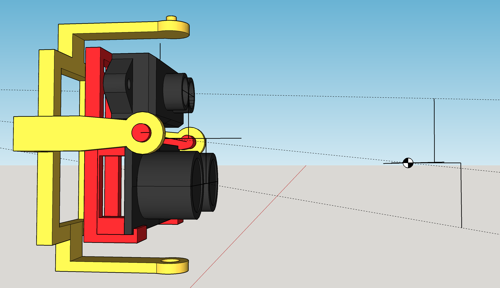
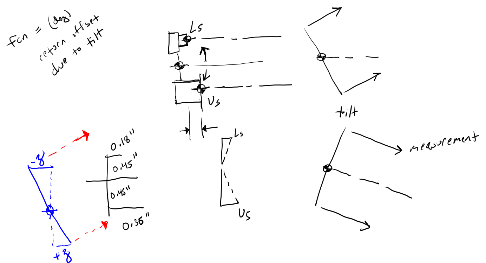

In the grand scheme none of this really matters due to the awful tolerances both in terms of mechanical design and sensor reliability.
You can see below the issue. I believe when I designed this "sensor assembly" months ago I only centered the sensors vertically.
I did not consider the front/back(z-axis) centering. I also was not entirely sure where the waves technically started/propogated from.
I guess it's at the face of the sensor cylinders but maybe it's at the board level.

So what I need to do is create a function where you feed in the sensor/angle and get the offset(whether it's add or subtract)
