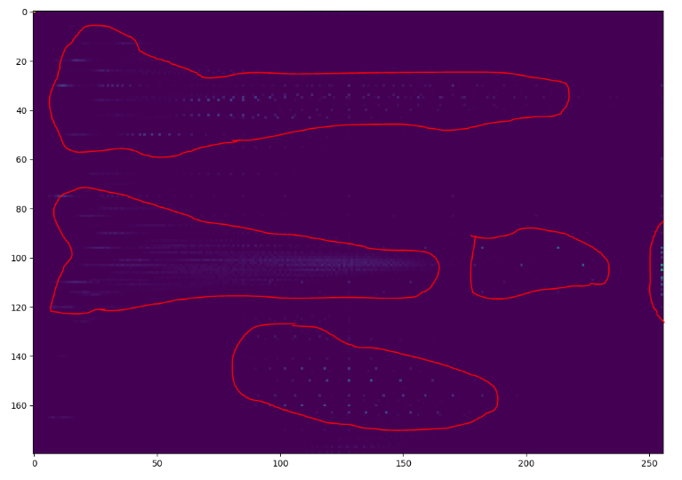

### Vision steps
The vision process boils down to using find contours after applying HSV ranges to look at. The HSV ranges are from the light (H, 1D histogram) and SV values from 2D histogram(color)
- take image
- perform 1D histogram to get light range (V)
- perform 2D histogram to get color range (H,S)
- apply mask over image for contour finding
- find contours and based on threshold(size of object/square) return possible obstacles
- sensor bed gets distances of the obstacles
- store into world coordinate system running in thread to update local map
- decide which way robot goes

- calibrate camera with horizon
- if boxes/boundaries are floating in midair, extend them downwards... unless height or sweep determines nothing under them

### Notes
- prioritize finding/scanning of nearest objects from an initial depth probe

- scanning process
  - [ ] do sensor sweep
    - anything in the way?
      - [ ] send command down from web(manual testing)
        - unfortunately no feedback from servo so just have to do some stepped sampling and  match pulses like us sensor
          concern is how fine(angle steps), since the farther away the larger the horizontal/vertical distances
  - take image
  - apply histograms/get bounds
  - point sensor bed to get measurements, hopefully hit targets
  - report to internal world coordinate system and to ThreeJS web interface

### 02/17/2021
Starting to work on histogram2d which finds H and S values for the mask.
Seems like need to look for clusters/get some general rules down eg. closer to 0 for S/x-axis means lighter color.
May need better sample images that have obvious color groups.

Lol so I ping a friend of mine who's really good at math and I'm like I'm trying to do this (screenshot below) and then he dumps this out into a text message lmao crazy. So yeah I gotta learn/see if I can use k-means.

> I have some scripts that do something like this. The technique is called "k-means". It's actually a pretty simple script, you may be able to write it yourself without much guidance. It doesnt draw boundary curves. It uses a number of "seed" points to determine which points are closest together (in groups). Here's the basics.
> 1) determine the number of groups to form (e.g. 4 groups). This is your k value. K=4
> 2) seed k=4 points randomly in your design space. If the x and y axes are both 0-256, then give each seed point a random (x, y) coordinate.
> 3) Now you iterate for some large number of iterations (e.g. 100). At each step in tje iteration, calculate the euclidean distance from each sample point to each seed point. If you have 200 sample points and 4 seed points, you will calculate 800 distances. Distance = sqrt((x2-x1)^2 (y2-y1)^2). Then for each sample point, determine which seed point is closest. For 4 seed points, you will end up with 4 groups of points. (e.g., sample point 1 is closest to seed point 3. sample point 100 is closest to seed point 2.). Finally move each seed point to the average (x, y) of the sample points in it's group. (e.g. if there are 50 sample points closest to seed point 4, calculate the average (x, y) of those 50 sample points. That average is the new location of seed point 4 for the nexr iteration). Over time, tje seed points will move towards the centroids of each data set, and each group of sample
 points willbe sorted according to which point is nearest.

### 02/16/2021
Did get distracted with that readme not really anything new ego filling.
Aiming to put like 2 hours of silence work into this project since it's not trivial/I really need to focus/pay attention.

### 02/14/2021
Working on the plot value chunker
https://jsfiddle.net/qsw2co0x/18/

### 02/13/2021
Back on this project again finally... had to make a couple of bs personal todo-esk crud apps so I can feel good about my life.
I have to remember the steps.
This is pretty neat actually I have to consider if it's dark and then if so change the scanning methods eg. rely on ToF sensors more than vision.

I was trying to return sectioned x-ranges from histogram1D although the first sample image has a contiguous plot so I'm hoping the new images have broken up x ranges/groups on the plot so I can return the separated array of array start/stop pairs

### ~~12/24/2020~~ 12/25/2020
~~I'm not as "fresh" as I'd like to be, I had to deal with some stuff hours ago. I'm hoping I can still be productive.
Been up about 5 hours already and between now and then have eaten... I usually try not to eat/only partake in caffeine to be "pure" optimal~~

Well... scratch that, wasted that day, here I am now next day. Already ate though.

I did have a thought, I should be able to just re-use the panning code from the ultrasonic sensor for lidar, just change the sensor call.
Need to establish some boundaries too. Robot dimensions 8.5" x 10" x 11" these are upwardly approximated.
Overall nothing is square, minor irregularities here and there... ideally that's fine. The device adapts/recalibrates.
Camera height when mounted on robot platform: 8.5"
Sensor bed center point height: 5" 5/8"

You know... I don't want to do this it turns out haha. But I gotta finish it.

I'm gonna focus on coming up with some kind of sampling algorithm. The depth probing is a way to narrow down what to look for that matters.
Since as a human you can easily be like "there's an object, there's an object" etc... but camera/pixels no idea what's what.
Can just do boundary detection/find blobs of things.