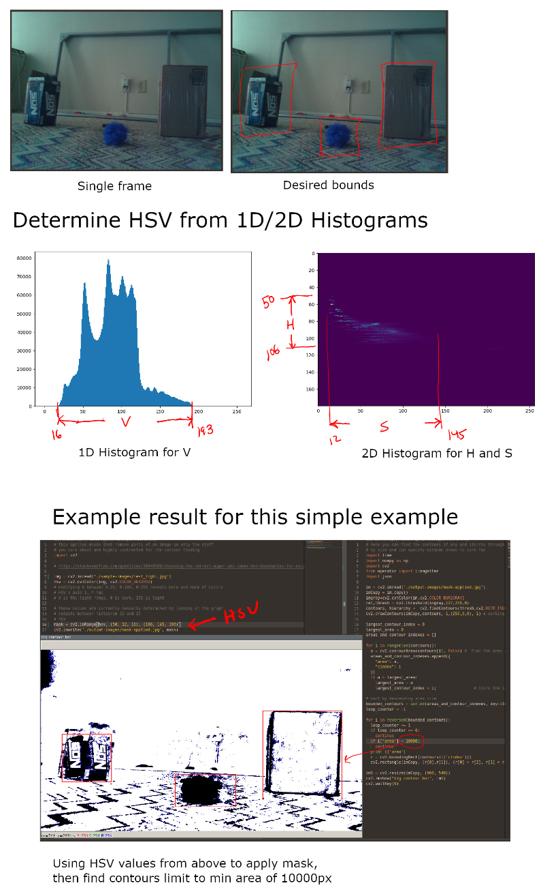
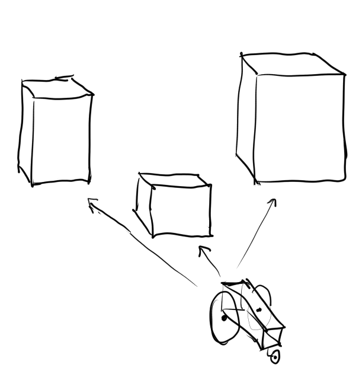

### About
This is the vision process of this "aparatus". There is a single camera and I'm using 1D and 2D histograms to define the places to look to bind potential objects with HSV. Then using contour finding I find the largest area after a specific minimum area.

It is easier to visually see what I mean by the 1D/2D histograms seeing the images below.

### "The process"

These bounds are treated as cubes for now/to make it simple. The distances are measured with the ToF sensors and then these values are stored in the "world coordinate system" where the center point(where robot was first turned on) is moved around based on IMU data.

I do realize how "lucky"/ideal this simple sample image is. Indeed other images are way harder to draw bounds around, particularly the 2D histogram aspect, that's why I have to step through/sample all the groups. It's also noticeable on the single core Raspberry Pi that can take a process and make it 30 times longer to process due to its processing capability.

### Other notes

Will point out, with the ToF sensors and if it's very dark(V from 1D histogram) can also do preliminary distance sweeps.